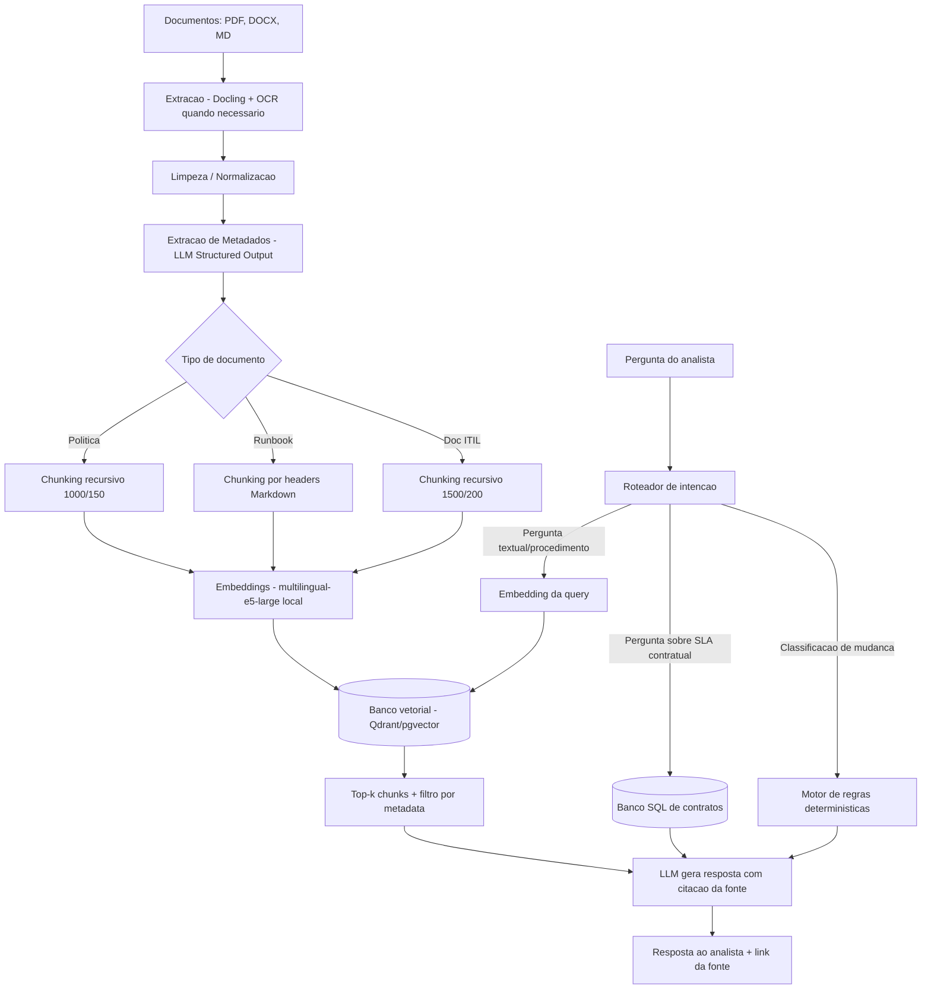
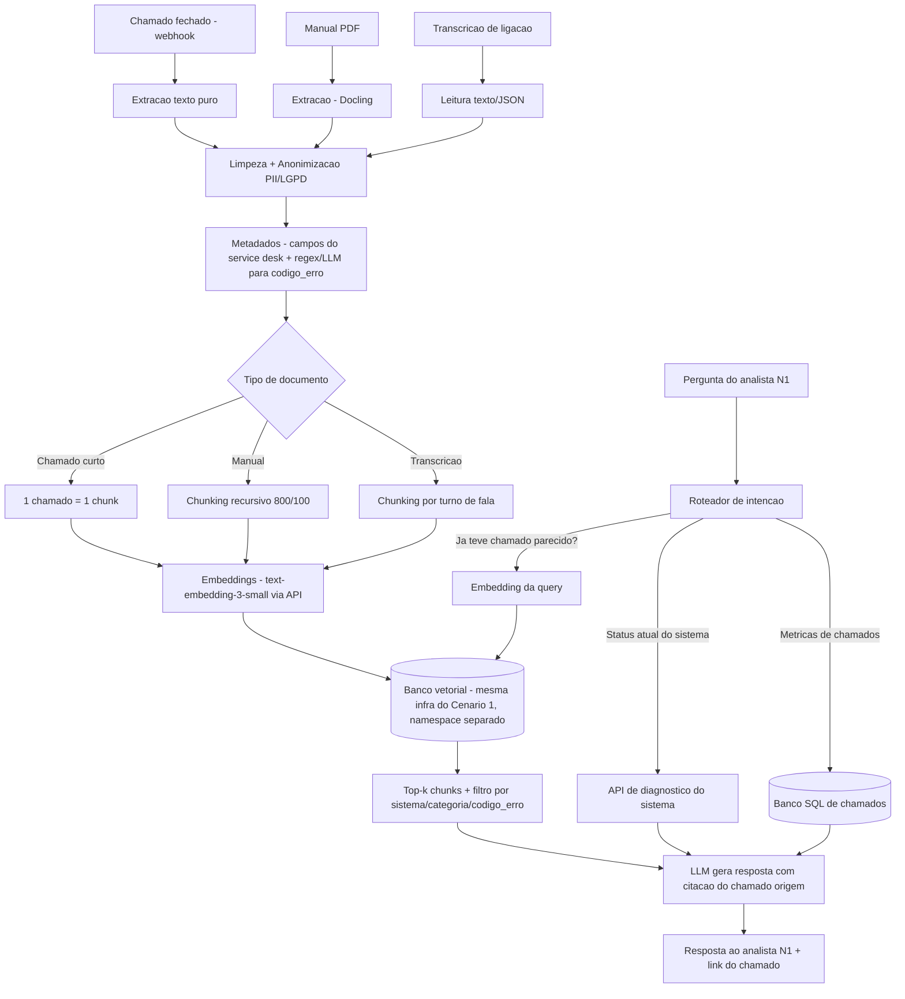

# Aula 06 - 14/08 - Projeto e Arquitetura de uma Aplicação RAG

**Autor:** Janice
**Data:** 14/08/2026

---

## Sumário

- [Cenário 1 — Assistente RAG para Gestão de Serviços de TIC](#cenário-1--assistente-rag-para-gestão-de-serviços-de-tic-itsmitil)
- [Cenário 2 — Assistente RAG para Atendimento de Suporte de TI](#cenário-2--assistente-rag-para-atendimento-de-suporte-de-ti)
- [Comparação entre os dois cenários](#comparação-entre-os-dois-cenários)
- [Como usei IA para essa atividade](#como-usei-ia-para-essa-atividade)
- [Referências](#referências)

---

# Cenário 1 — Assistente RAG para Gestão de Serviços de TIC (ITSM/ITIL)

## Parte 1 — Identificação dos problemas

### 1.1 Descrição do problema

Uma empresa de médio porte (~800 colaboradores) opera sua área de TI seguindo
o framework **ITIL v4**, com processos formalizados de gestão de incidentes,
mudanças, problemas e catálogo de serviços. A base de conhecimento inclui
normas internas, procedimentos operacionais padrão (POPs), políticas de
segurança da informação, runbooks técnicos e a documentação do próprio ITIL
adaptada à realidade da empresa.

**Usuário concreto**: Analista de Suporte N2 (nível intermediário), 2-4 anos
de experiência, atua na linha de frente atendendo chamados que exigem mais
que o script de N1. Conhece a operação, mas não decora centenas de páginas de
procedimento — sabe que a informação existe, mas não onde exatamente.
Trabalha sob pressão de SLA (tempo de resposta contratual), então precisa de
respostas rápidas e confiáveis, não de "ir catar no SharePoint".

**Tipo de informação consultada**: "Qual o procedimento de aprovação para uma
mudança emergencial fora do horário comercial?", "Quais os passos do runbook
para resolver falha recorrente no serviço de VPN?", "Qual é o SLA contratual
para incidentes de severidade 2 no cliente X?".

**Origem das informações**: documentos internos da área de TI — políticas em
DOCX/PDF publicadas pelo comitê de governança, runbooks técnicos em Markdown
mantidos pelos próprios analistas em um wiki interno (Confluence), e a
documentação de processo ITIL (adaptada) também em PDF.

**Por que um LLM sozinho não seria suficiente**: o conhecimento necessário é
**específico da organização** — SLAs contratuais variam por cliente, os
runbooks descrevem sistemas proprietários e integrações internas, e as
políticas de aprovação de mudança são definições internas do comitê de
governança. Nenhuma dessas informações está no conhecimento pré-treinado de
um LLM público, e mesmo que estivesse (via fine-tuning), ela muda com
frequência suficiente para tornar o fine-tuning caro e desatualizado
rapidamente.

**Modo de uso**: interface de chat web interna (ex.: um plugin dentro do
próprio Confluence/Teams), acessível também via API para ser embutida na
ferramenta de abertura de chamados (ex.: sugestão automática de runbook ao
analista no momento em que ele abre um ticket).

**Três perguntas reais que um usuário faria**:
1. "Preciso reiniciar o serviço de autenticação do cliente Y fora do horário
   comercial, isso conta como mudança emergencial ou eu já posso executar?"
2. "O chamado caiu como severidade 2, mas o cliente está reclamando que já
   passou o prazo — qual é o SLA real que fechamos com eles?"
3. "Tem algum runbook pra quando a VPN cai só pra usuários do time financeiro
   e não pros outros?"

### 1.2 Por que RAG?

RAG é adequado porque o conhecimento necessário é **volumoso, textual,
mutável e específico da organização** — exatamente o tipo de conhecimento que
não cabe (nem deveria) no prompt inteiro, e que não pode ser "ensinado" de
uma vez só ao modelo via fine-tuning porque muda constantemente.

**Tipo de conhecimento**: procedimentos formais (texto estruturado com
seções, passos numerados), políticas (texto normativo), runbooks técnicos
(texto + comandos/trechos de configuração).

**Frequência de mudança**: políticas de governança mudam **raramente**
(trimestral/semestral, após revisão de comitê); runbooks técnicos mudam **com
mais frequência** (podem ser atualizados toda vez que um analista encontra
uma solução nova para um problema recorrente — semanal); os SLAs contratuais
mudam **na renovação de contrato** com cada cliente (variável, mas
tipicamente anual).

**Documentos privados/específicos da organização**: sim, 100% dos documentos
são internos — SLAs contratuais e runbooks descrevendo a infraestrutura
específica da empresa nunca estariam em um LLM público.

**Exemplo concreto de resposta errada de um LLM sem RAG**: se perguntado "qual
o SLA de severidade 2 para o cliente X", um LLM sem contexto tenderia a
**inventar** um número plausível (ex.: "geralmente SLAs de severidade 2 são
de 4 horas úteis"), baseando-se em padrões genéricos de mercado — o que pode
estar completamente errado para aquele contrato específico e gerar uma
resposta ao cliente com prazo incorreto, uma falha grave em um contexto onde
SLA é cláusula contratual com multa.

### 1.3 Limitações — quando RAG não é a resposta

- **Busca tradicional por palavra-chave**: seria suficiente (e mais rápida/
  barata) se o analista já soubesse o nome exato do documento ou termo técnico
  exato (ex.: buscar literalmente "POP-042"). RAG adiciona valor quando a
  pergunta é feita em linguagem natural e o analista não sabe o termo exato
  usado no documento.
- **Banco de dados estruturado (SQL)**: é a ferramenta certa para os **SLAs
  contratuais em si** — SLA por cliente/severidade é um dado tabular
  (cliente, severidade, prazo em horas), não um texto para "buscar
  semanticamente". Manter isso em RAG é um antipadrão: o sistema pode
  recuperar o SLA errado de um cliente parecido, quando uma query SQL
  simples (`SELECT prazo FROM slas WHERE cliente='X' AND severidade=2`)
  responde com 100% de precisão.
- **Regras determinísticas**: a decisão "isso é mudança emergencial ou não"
  segue um fluxograma de decisão claro (mudança fora do horário + impacto em
  produção = emergencial). Isso é mais bem resolvido por uma árvore de
  decisão/regras de negócio codificadas do que por um LLM interpretando texto
  — há risco de o LLM "alucinar" uma interpretação flexível demais de uma
  regra que deveria ser rígida.
- **Combinação (a que efetivamente recomendo)**: RAG para runbooks e
  políticas (texto não estruturado, precisa de busca semântica) + consulta
  SQL para SLA contratual (dado estruturado) + regras determinísticas para
  classificação de mudança emergencial. O agente conversacional decide qual
  ferramenta acionar conforme o tipo de pergunta (roteamento por intenção).

**Pergunta que RAG responderia mal, e SQL bem**: "Quais os 5 clientes com
mais chamados de severidade 1 nos últimos 3 meses?" — isso exige **contar e
ordenar** registros estruturados de chamados. RAG recuperaria alguns chunks
de texto relevantes (ex.: um relatório mensal específico), mas não teria como
agregar corretamente todos os chamados de todos os meses espalhados em
múltiplos documentos — o LLM tenderia a responder com base em uma amostra
incompleta dos chunks recuperados, dando uma resposta plausível mas
estatisticamente errada. Isso é claramente um caso de `SELECT ... GROUP BY
... ORDER BY ... LIMIT 5` em um banco relacional de chamados.

**Sobre contar/somar/ordenar**: RAG não agrega bem informação dispersa em
muitos documentos, porque a etapa de recuperação retorna apenas um **top-k**
de chunks (ex.: os 5 mais similares à pergunta) — não uma varredura completa
do corpus. Perguntas agregadas exigem acesso a **todos** os registros
relevantes, o que é natureza de banco de dados, não de busca por similaridade
vetorial.

## Parte 2 — Organização dos documentos

**Tipos de arquivo**: PDF (políticas formais publicadas pelo comitê,
documentação ITIL), Markdown (runbooks mantidos no wiki interno/Confluence,
exportados periodicamente), DOCX (procedimentos em elaboração/revisão antes
de virarem PDF final), planilhas XLSX (apenas para a tabela de SLA por
cliente — que, como já justificado, **não entra na base vetorial**, fica em
banco relacional).

**Volume aproximado**: algumas centenas de documentos (~300–500), típico de
uma área de TI de médio porte — não é um volume de "milhares" que exigiria
arquitetura de streaming de ingestão.

**Tamanho típico**: políticas formais, 5–15 páginas (PDF); runbooks técnicos,
mais curtos, 1–3 páginas cada (Markdown); documentação ITIL, mais longa,
pode chegar a 50+ páginas em um único documento de referência.

**Frequência de novos documentos**: baixa a moderada — políticas são
raramente criadas (poucas por trimestre), mas runbooks são atualizados com
frequência maior (os analistas os editam toda vez que resolvem algo novo,
podendo ser semanal).

**Estrutura de pastas proposta**:

```
documentos/
├── politicas/
│   ├── seguranca_informacao/
│   ├── governanca_mudancas/
│   └── privacidade_lgpd/
├── runbooks/
│   ├── rede_vpn/
│   ├── autenticacao_identidade/
│   ├── infraestrutura_cloud/
│   └── aplicacoes_criticas/
├── procedimentos_itil/
│   ├── gestao_incidentes/
│   ├── gestao_mudancas/
│   └── gestao_problemas/
└── obsoletos/          <- NUNCA indexado, só para histórico/auditoria
```

**Justificativa**: a divisão por `politicas/ runbooks/ procedimentos_itil/`
reflete exatamente como o analista pensa a pergunta — "isso é uma dúvida de
regra/aprovação (política)" vs. "isso é uma dúvida técnica de como resolver
(runbook)" vs. "isso é sobre o processo ITIL em si". Essa categoria vira
diretamente um **filtro de metadado** (`document_type`) na hora da busca:
se o analista pergunta algo claramente técnico ("como resolver falha de
VPN"), o sistema pode restringir a busca a `runbooks/rede_vpn/`, reduzindo
ruído de recuperação. As subpastas de `runbooks/` por sistema (VPN,
autenticação, cloud) também viram filtro — importante porque um mesmo termo
("falha de conexão") pode aparecer em contextos de sistemas bem diferentes.

**Documentos que não devem entrar na base**: rascunhos de política ainda não
aprovados pelo comitê de governança (podem conter regras que ainda vão
mudar), e qualquer runbook com credenciais ou segredos colados no meio do
texto (prática ruim mas que acontece). Isso é impedido com uma etapa de
**triagem antes da ingestão**: só documentos com um metadado `status:
aprovado` (definido manualmente por quem publica) e uma checagem automática
de padrões de segredo (regex para senhas, tokens, chaves de API) que barra a
ingestão e alerta o responsável se detectar algo.

**Versionamento**: cada documento carrega `version` e `updated_at` nos
metadados. Ao reprocessar uma nova versão do mesmo documento, o
**`document_id` permanece o mesmo**, mas os chunks antigos daquele
`document_id` são **removidos do banco vetorial antes de inserir os novos**
(delete-then-insert, não apenas soma). Isso evita o cenário citado no
enunciado — se a política de mudanças mudou em 2026, a versão de 2024 precisa
sair de circulação, não apenas "ficar competindo" com a nova no ranking de
similaridade.

## Parte 3 — Pipeline de ingestão

```
Documentos (PDF, DOCX, MD)
    ↓
Extração (Docling para PDF/DOCX, leitura direta para MD)
    ↓
Limpeza / normalização (remoção de cabeçalho/rodapé repetido, padronização)
    ↓
Metadados (document_type, categoria, versão, extraídos via LLM + regras)
    ↓
Chunking (recursivo, adaptado por tipo de documento)
    ↓
Embeddings (multilingual-e5-large, local)
    ↓
Banco vetorial (ex.: Qdrant/pgvector, com filtro por metadado)
```

### 3.1 Extração

**PDFs com texto selecionável** (a maioria das políticas formais): extração
direta com o **Docling** (já usado nas atividades anteriores desta
disciplina), que preserva headings, parágrafos e tabelas em Markdown
estruturado.

**PDFs digitalizados/escaneados**: alguns procedimentos mais antigos da
empresa foram digitalizados como imagem (scan de documento assinado
fisicamente, por exemplo). Nesses casos, é necessário **OCR** antes da
extração — o próprio Docling suporta um modo de OCR (usamos, por exemplo, o
RapidOCR integrado, como já vimos rodar automaticamente na conversão de PDFs
em atividades anteriores desta disciplina, quando um PDF continha imagem sem
camada de texto). A qualidade do OCR precisa ser validada manualmente para
documentos críticos (ex.: política de segurança assinada), porque erro de
OCR em uma cláusula pode mudar completamente o sentido.

**Tabelas**: **é importante manter**. Runbooks frequentemente têm tabelas de
"sintoma → causa provável → ação" — extrair isso como texto corrido destrói
a relação entre colunas. O Docling converte tabelas para Markdown
(`| coluna | coluna |`), preservando a estrutura, como confirmamos nas
atividades anteriores desta disciplina ao inspecionar os `.md` gerados.

**Imagens**: **descartadas na maior parte dos casos**, mas com o marcador de
posição preservado (`<!-- image -->`), exatamente como observamos na
conversão dos PDFs das atividades anteriores. Isso é aceitável para a maioria
dos runbooks (texto é suficiente), mas há um risco real: alguns runbooks têm
**diagramas de arquitetura de rede** como imagem — a informação visual ali
(topologia da VPN, por exemplo) se perde completamente. Para esses casos
específicos, o ideal seria gerar uma **descrição textual da imagem via
modelo multimodal** (vision-to-text) na etapa de extração, e armazenar essa
descrição como parte do chunk correspondente — não descartar.

**Documentos multimodais**: não é um caso comum neste cenário (a base é
majoritariamente texto), mas se surgir um vídeo de treinamento gravado
(ex.: onboarding de novo analista explicando um runbook), a abordagem seria
extrair a transcrição de áudio (Whisper ou similar) e tratar o texto
resultante como um documento normal — a imagem do vídeo em si não entraria na
base, só a transcrição.

**Problemas concretos já enfrentados**: nas atividades anteriores desta
disciplina, ao converter PDFs acadêmicos com o Docling, vimos que imagens
viram apenas o marcador `<!-- image -->` sem descrição — isso é exatamente o
mesmo problema que os diagramas de rede teriam aqui, e reforça a necessidade
da etapa de descrição via modelo multimodal para esse tipo específico de
documento neste cenário.

### 3.2 Limpeza e normalização

**Remover**: cabeçalho/rodapé institucional repetido em toda página (logo da
empresa, "Confidencial — Uso Interno", número de página), sumário automático
(atrapalha o chunking porque não é conteúdo, é navegação), e marca d'água de
"RASCUNHO" em documentos que não deveriam nem ter passado pela triagem (mas
funciona como segunda camada de proteção).

**Padronizar**: codificação para UTF-8 (documentos antigos às vezes vêm em
Latin-1/Windows-1252, causando caracteres quebrados em "ç", "ã"), normalizar
quebras de linha (`\r\n` → `\n`), e colapsar espaçamento duplo/triplo
acidental que o Docling às vezes gera na conversão de tabelas complexas.

**Risco de limpar demais**: remover "tudo que parece cabeçalho" de forma
automática pode acidentalmente cortar um **título de seção real** que
coincidentemente aparece no topo de uma página (ex.: "3. Procedimento de
Rollback" pode ser confundido com cabeçalho repetido se o regex for genérico
demais). A limpeza de cabeçalho/rodapé deve comparar se a linha se repete
**identicamente em várias páginas do mesmo documento** antes de removê-la,
não remover por "parecer" cabeçalho.

### 3.3 Frequência de ingestão

O pipeline roda de forma **agendada** (diária, de madrugada) para políticas e
documentação ITIL — baixo volume de mudança não justifica processamento em
tempo real. Para os **runbooks** (que os analistas editam com mais
frequência no wiki), a ingestão é **orientada a evento**: um webhook do
Confluence dispara o reprocessamento assim que uma página é salva.

**Reprocessamento**: quando um documento é atualizado, reprocessamos **só
ele** — o `document_id` é conhecido (vem do próprio sistema de origem, ex.:
o ID da página no Confluence), então o pipeline localiza e remove os chunks
antigos daquele `document_id` antes de inserir os novos, sem tocar no resto
da base. Reprocessar a base inteira a cada mudança seria desperdício de
custo computacional e tempo, sem necessidade.

## Parte 4 — Metadados

### 4.1 Metadados do documento

```json
{
  "document_id": "runbook-vpn-042",
  "title": "Runbook: Falha recorrente de VPN para grupos específicos",
  "author": "equipe-redes",
  "source": "confluence://espaco-ti/pagina/8823",
  "document_type": "runbook",
  "category": "rede_vpn",
  "version": 3,
  "status": "aprovado",
  "created_at": "2025-02-10",
  "updated_at": "2026-07-22"
}
```

### 4.2 Metadados do chunk

```json
{
  "document_id": "runbook-vpn-042",
  "chunk_id": "runbook-vpn-042-03",
  "section": "Passo 3 — Verificar política de grupo no servidor RADIUS",
  "document_type": "runbook",
  "category": "rede_vpn",
  "version": 3,
  "text": "..."
}
```

**Por que cada metadado importa**:
- `document_type` e `category`: usados para **filtrar** a busca antes mesmo
  do cálculo de similaridade — evita que uma pergunta técnica sobre VPN
  recupere um chunk de política de RH por coincidência léxica.
- `status`: garante que só documentos aprovados entrem na busca (barreira de
  governança, ligada à Parte 2).
- `version` e `updated_at`: usados para garantir que, se por algum motivo
  duas versões coexistirem temporariamente durante uma reingestão, o sistema
  prioriza/filtra pela mais recente — mitigação adicional ao problema de
  versão desatualizada.
- `source`: essencial para **citar a fonte** ao usuário — sem isso, o
  analista não consegue verificar/abrir o documento original.
- `section`: permite citar não só "de qual documento veio", mas "de qual
  parte" — importante em documentos longos (a documentação ITIL tem 50+
  páginas; dizer "seção 4.2" é bem mais útil que "está em algum lugar do
  documento ITIL").

**Exemplo de pergunta em que o filtro é indispensável**: "Como resolver
problema de VPN para o time financeiro?" — sem filtrar por
`category=rede_vpn`, um runbook de "problema de autenticação" (outra
categoria, mas com vocabulário parecido: "grupo", "acesso negado") poderia
competir na similaridade e ser recuperado por engano.

**O que aparece na tela junto da resposta**: título do documento (`title`),
seção específica (`section`), e um link direto (`source`, resolvido para a
URL real do Confluence) — permitindo ao analista abrir a fonte original com
um clique para conferir.

**Metadado caro de acrescentar depois**: `category` (a subcategoria de
runbook, ex. `rede_vpn` vs. `autenticacao_identidade`). Se não for definida
já na ingestão inicial, adicionar depois exige **reprocessar e reclassificar
todo o histórico de documentos já indexados** — ou fazer isso manualmente,
documento por documento, o que não escala para centenas de arquivos.
Metadados como `updated_at`, por outro lado, são baratos de adicionar depois
(basta consultar a data de modificação do arquivo).

**Como extrair**: `document_type` e `category` são inferidos com um
**LLM com Structured Outputs** (técnica já usada nas atividades anteriores
desta disciplina, na extração de metadados de PDFs), lendo o início do
documento e classificando conforme um schema fixo de categorias predefinidas
pela área de TI (evita que o modelo "invente" uma categoria nova a cada
documento). `source`, `created_at`, `author` vêm diretamente dos metadados do
sistema de origem (Confluence/SharePoint), sem precisar de LLM.

## Parte 5 — Chunking / Splitting

**Estratégia**: **Recursive Character Text Splitter** como base geral, mas
com tratamento **diferenciado por tipo de documento** — um contrato de
política formal e um runbook técnico não pedem o mesmo corte:

- **Políticas** (texto normativo, cláusulas): `chunk_size=1000` caracteres,
  `overlap=150`. Justificativa: cláusulas de política nesta empresa
  costumam ter entre 3 e 6 parágrafos (testado manualmente em 8 documentos de
  amostra); abaixo de ~800 caracteres, uma cláusula se parte no meio da
  condição e da exceção (ex.: "esta regra se aplica a X, EXCETO quando Y" —
  cortar entre "X" e "EXCETO" inverte o sentido da cláusula). O overlap de
  150 cobre a fronteira entre cláusulas vizinhas sem duplicar demais.
- **Runbooks** (passo a passo numerado): divisão por **estrutura Markdown**
  (Markdown Header Splitter), porque cada "Passo N" já é uma unidade de
  sentido natural do documento — um runbook não deve ter um passo cortado ao
  meio, isso tornaria a instrução inexecutável.
- **Documentação ITIL** (documento de referência longo, com subseções):
  splitter recursivo com `chunk_size=1500`, `overlap=200` — maior que o das
  políticas porque o conteúdo é mais explicativo/narrativo (menos denso em
  regras binárias por frase), tolerando chunks um pouco maiores sem perder
  coerência.

**O que acontece se os chunks forem muito pequenos**: uma cláusula de
política ou um passo de runbook perde o contexto da condição/exceção que a
acompanha — o modelo responde com uma regra incompleta (ex.: aplica uma regra
sem saber da exceção que estava no parágrafo cortado fora).

**O que acontece se forem muito grandes**: chunks grandes demais diluem a
relevância — um chunk de 4000 caracteres cobrindo 3 passos diferentes de um
runbook reduz a precisão da recuperação (o embedding "mistura" 3 assuntos), e
aumenta o custo de tokens enviados ao LLM na geração da resposta sem
necessariamente melhorar a qualidade.

**Tabelas no chunking**: uma tabela cortada ao meio **não** significa mais
nada de confiável — ex., uma tabela "sintoma → causa → ação" cortada entre a
coluna de causa e a de ação vira uma lista de sintomas sem solução associada,
o que é pior que não ter a tabela. A estratégia adotada é: se uma tabela for
detectada dentro dos limites de um chunk candidato, o splitter é configurado
para **nunca cortar dentro dos delimitadores markdown de tabela**
(usamos separadores customizados no splitter recursivo, priorizando quebra
antes/depois do bloco de tabela inteiro, mesmo que isso gere um chunk um
pouco acima do tamanho alvo). Uma imagem (quando convertida em descrição
textual, conforme decidido na Parte 3.1) é tratada como uma unidade curta e
geralmente cabe inteira dentro de um chunk sem necessidade de tratamento
especial.

**Como validar se a escolha de chunking foi boa**: montar um conjunto de
~20-30 perguntas reais (como as da Parte 1.1, mas expandido) com a resposta
esperada e o documento/seção de onde ela deveria vir, e medir se o chunk
correto aparece no top-3 recuperado (métrica de **recall@3**). Além disso,
inspecionar manualmente uma amostra de chunks gerados por cada estratégia
para verificar se cláusulas/passos foram cortados no meio — evidência
qualitativa complementar à quantitativa.

## Parte 6 — Embeddings

| Item | Valor |
| --- | --- |
| Modelo escolhido | `intfloat/multilingual-e5-large` |
| Dimensão do embedding | 1024 |
| Suporta português? | Sim |
| É multilíngue? | Sim (100 idiomas) |
| Tamanho máximo de entrada | 512 tokens |
| É open source? | Sim (Hugging Face, pesos públicos) |
| Pode ser executado localmente? | Sim |
| Possui API? | Não nativa da Microsoft/intfloat; pode ser servido via API própria (self-hosted) ou provedores terceiros (ex.: DeepInfra) |
| Custo aproximado | Gratuito se self-hosted (custo = infraestrutura de GPU/CPU); ~centavos de dólar por milhão de tokens se via provedor terceiro |
| Fonte da informação (link) | https://huggingface.co/intfloat/multilingual-e5-large |

**Por que esse modelo é adequado a este cenário**: os documentos são 100%
internos e incluem políticas de segurança da informação — dados que a área
de governança da empresa não autorizaria enviar a uma API de terceiros (ainda
que a política de retenção de dados do provedor seja favorável, é uma
barreira de compliance interna comum em empresas com ITIL/ISO 27001
maduros). Rodar localmente elimina esse risco por completo. O volume
(algumas centenas de documentos) é pequeno o suficiente para rodar em CPU/GPU
modesta sem gargalo de custo de infraestrutura, e o suporte a português é
comprovado (o modelo é treinado para 100 idiomas, incluindo português).

**Modelo alternativo considerado e descartado**: `text-embedding-3-large` da
OpenAI foi considerado pela qualidade de recuperação superior (a diferença é
de poucos pontos percentuais no benchmark MTEB de retrieval, mas existe) —
foi descartado justamente pela restrição de **enviar políticas de segurança
interna para uma API externa**, que fere a postura de governança da área de
TI descrita no cenário.

**Sigilo dos documentos muda a escolha entre local e API?** Sim, é o fator
decisivo aqui — com dados menos sensíveis, a conveniência e a leve vantagem
de qualidade de uma API paga poderiam compensar. Com políticas de segurança
da informação envolvidas, a escolha por hospedagem local não é uma
preferência técnica, é uma exigência de governança.

**Relação entre tamanho máximo de entrada e chunking**: o limite de **512
tokens** do `multilingual-e5-large` é uma restrição direta sobre a Parte 5 —
os `chunk_size` escolhidos (1000–1500 **caracteres**, não tokens) precisam
ser verificados para não ultrapassar ~512 tokens (aproximadamente 350-450
palavras em português, dependendo da densidade de pontuação). Os tamanhos
escolhidos na Parte 5 foram calibrados justamente para ficar dentro dessa
margem com folga — um chunk de 1500 caracteres em português normalmente fica
entre 220–280 tokens, bem abaixo do limite.

## Arquitetura final



### Tabela de decisões

| Etapa | Decisão | Justificativa em uma linha |
| --- | --- | --- |
| Extração | Docling (+ OCR quando necessário) | Preserva headings e tabelas em Markdown; já validado nas atividades anteriores da disciplina |
| Limpeza | Remove cabeçalho/rodapé só se repetido literalmente em várias páginas | Evita apagar títulos de seção reais por engano |
| Metadados | LLM com Structured Output + dados do sistema de origem | Classificação consistente (schema fixo) sem "inventar" categorias novas |
| Chunking | Recursivo, com regras específicas por tipo de documento | Políticas, runbooks e docs ITIL têm estruturas de sentido diferentes |
| Embeddings | `multilingual-e5-large`, self-hosted | Documentos internos sensíveis não podem ir a API de terceiros |
| Banco vetorial | Qdrant/pgvector com filtro por metadado | Volume moderado não exige solução gerenciada cara; filtro por metadado é essencial (Parte 4) |
| Roteamento | LLM decide entre RAG / SQL / regras conforme a pergunta | SLA é dado tabular, classificação de mudança é regra — nem tudo é RAG |

### Riscos e limitações desta proposta

- O roteador de intenção (decidir se a pergunta vai para RAG, SQL ou regras)
  é ele mesmo um ponto de falha — se classificar errado, o analista recebe
  uma resposta de RAG para uma pergunta que precisava de SQL preciso (ex.:
  "quantos chamados abertos este mês", classificado erroneamente como
  pergunta de runbook).
- A qualidade da extração de metadados via LLM não é 100% — documentos
  ambíguos (um runbook que também descreve uma política) podem ser
  classificados na categoria errada e ficarem "escondidos" de buscas
  filtradas.
- A descrição textual de imagens (diagramas de rede) via modelo multimodal
  não foi validada neste projeto — é uma proposta, não uma solução testada;
  pode gerar descrições imprecisas de topologias complexas.
- O sistema não resolve bem perguntas de agregação/contagem (já discutido na
  Parte 1.3) — isso é uma limitação reconhecida, não um bug a corrigir dentro
  do escopo de RAG.

---

# Cenário 2 — Assistente RAG para Atendimento de Suporte de TI

## Parte 1 — Identificação dos problemas

### 1.1 Descrição do problema

A mesma área de TI da empresa opera uma central de suporte (helpdesk) que
recebe chamados via ferramenta de service desk (ex.: Jira Service
Management), com histórico de **milhares de chamados já resolvidos** (cada
um com descrição, diagnóstico e solução aplicada), manuais de produto/
sistema, e **transcrições de ligações de atendimento por telefone** (geradas
por um sistema de transcrição automática, com qualidade variável).

**Usuário concreto**: Analista de Suporte N1 (nível de entrada, 0-1 ano de
experiência), alto turnover na função, atende grande volume de chamados
repetitivos por dia. Nível técnico baixo/médio — segue scripts e procura por
"alguém que já resolveu isso antes", não domina a causa raiz dos problemas.
Muito menos autônomo que o analista N2 do Cenário 1.

**Tipo de informação consultada**: "Alguém já resolveu um problema parecido
com esse antes? Como?", "O que o manual do sistema X diz sobre esse erro de
código E-4471?", trechos de conversas anteriores de suporte sobre um sintoma
específico.

**Origem das informações**: chamados fechados no service desk (texto livre
digitado pelo analista anterior), manuais de produto (PDF dos fornecedores,
nem sempre em português), e transcrições de call center (texto gerado
automaticamente, com erros de transcrição e sem pontuação confiável).

**Por que um LLM sozinho não seria suficiente**: o conhecimento mais valioso
aqui é a **experiência acumulada da própria operação** — como um chamado
específico e recorrente foi resolvido, com qual comando, qual causa raiz —
informação que não existe em nenhum lugar público, e que **muda todo dia**
conforme novos chamados são fechados.

**Modo de uso**: painel integrado diretamente na ferramenta de service desk
(o analista N1 nunca sai da tela do chamado), com resposta rápida — a
principal métrica de sucesso aqui é **velocidade**, porque o volume de
chamados é alto e o analista é júnior.

**Três perguntas reais que um usuário faria**:
1. "O cliente tá vendo erro E-4471 ao tentar sincronizar o app, já teve
   chamado parecido?"
2. "Como faço pra resetar a senha de administrador no sistema de folha de
   pagamento, o manual tá em inglês e eu não entendi direito"
3. "Peguei um chamado que já foi escalado 2 vezes e ninguém resolveu, tem
   histórico de conversa anterior sobre isso?"

### 1.2 Por que RAG?

**Tipo de conhecimento**: texto **não estruturado e informal** — descrições
de chamados escritas rapidamente por analistas sob pressão, transcrições de
áudio com ruído, manuais técnicos em outro idioma.

**Frequência de mudança**: **diária, alto volume** — cada chamado fechado é
um novo "documento" em potencial para a base, muito mais dinâmico que o
Cenário 1.

**Documentos privados/específicos**: sim, e com um agravante — chamados e
transcrições **contêm dados pessoais de clientes** (nome, e-mail, às vezes
dados de conta), o que traz implicações de **LGPD** que o Cenário 1 não tinha
com a mesma intensidade.

**Exemplo concreto de resposta errada de um LLM sem RAG**: perguntado "como
resolver erro E-4471 no app", um LLM sem contexto tenderia a dar uma resposta
**genérica de troubleshooting de app** (reinstalar, limpar cache) — quando a
causa real e específica deste sistema pode ser, por exemplo, um token de
sincronização expirado que só se resolve com um comando específico no
back-office interno, informação que só existe no histórico de chamados
já resolvidos daquela empresa.

### 1.3 Limitações — quando RAG não é a resposta

- **Busca por palavra-chave**: útil como complemento rápido para localizar
  um chamado pelo **número exato** (ex.: "chamado #48291") — RAG é
  desnecessário e mais lento para esse caso trivial.
- **Banco de dados estruturado**: essencial para as métricas operacionais do
  helpdesk (quantos chamados abertos, tempo médio de resolução por
  categoria, quantos foram escalados) — dado tabular por natureza.
- **Regras determinísticas**: útil para o roteamento inicial do chamado
  (ex.: "se contém a palavra 'senha' e categoria = financeiro, rotear para
  fila X") — mais confiável e auditável que deixar um LLM decidir o
  roteamento.
- **API direta**: se o sistema de origem do erro tiver uma API de
  diagnóstico (ex.: consultar o status real da sincronização do cliente em
  tempo real), isso é sempre mais confiável que qualquer busca em
  documentos — a API dá o estado **atual**, RAG só dá o que foi documentado
  no passado.
- **Combinação recomendada**: RAG para "já teve chamado parecido" +
  API direta para checar o status atual do sistema do cliente + regras para
  roteamento inicial + SQL para métricas de operação.

**Pergunta que RAG responderia mal, e SQL bem**: "Quantos chamados do erro
E-4471 tivemos essa semana?" — de novo um caso de contagem/agregação
espalhada por muitos "documentos" (chamados), que RAG não resolve
corretamente pelos mesmos motivos do Cenário 1.

**Sobre contar/somar/ordenar**: agravado neste cenário pelo volume — com
milhares de chamados, a chance de uma pergunta de agregação aparecer é
**maior** que no Cenário 1 (analistas frequentemente querem saber "isso é
comum?", que é essencialmente uma pergunta de contagem disfarçada de
pergunta em linguagem natural). É importante que o roteador de intenção
identifique esse padrão e desvie para SQL, não tente responder via RAG.

## Parte 2 — Organização dos documentos

**Tipos de arquivo**: texto livre exportado do service desk (chamados
fechados), PDF (manuais de fornecedores, muitos em inglês), texto puro/JSON
(transcrições de call center geradas automaticamente).

**Volume aproximado**: **milhares** de chamados fechados (a operação lida com
grande volume diário), dezenas de manuais de produto, centenas/milhares de
transcrições de ligação — ordem de grandeza bem maior que o Cenário 1.

**Tamanho típico**: chamados são **curtos** (parágrafos, não páginas — um
chamado típico tem 100-500 palavras entre descrição e resolução); manuais de
fornecedor são longos (50-200 páginas); transcrições variam mas tendem a ser
médias (uma ligação de 10 minutos gera ~1500 palavras de transcrição).

**Frequência de novos documentos**: **alta** — dezenas a centenas de novos
chamados fechados por dia, exigindo pipeline de ingestão praticamente
contínuo (diferente do Cenário 1, que é majoritariamente agendado/diário).

**Estrutura de pastas proposta**:

```
documentos/
├── chamados_resolvidos/
│   ├── por_sistema/
│   │   ├── folha_pagamento/
│   │   ├── app_sincronizacao/
│   │   └── ...
│   └── por_categoria/
│       ├── acesso_senha/
│       ├── erro_aplicacao/
│       └── performance/
├── manuais_fornecedor/
│   ├── sistema_folha_pagamento/
│   └── app_sincronizacao/
├── transcricoes_atendimento/
└── quarentena_lgpd/      <- dados pessoais não anonimizados, NUNCA indexado
```

**Justificativa**: diferente do Cenário 1 (onde a divisão era por
"natureza do documento" — política vs. runbook), aqui a divisão principal é
por **sistema/produto** dentro de `chamados_resolvidos/`, porque é assim que
o analista N1 pensa o problema ("é erro do app" vs "é erro da folha de
pagamento") — o sistema específico é o primeiro filtro natural que reduz o
espaço de busca. A segunda dimensão (`por_categoria/`) permite um filtro
cruzado (ex.: "erro de acesso, especificamente no sistema de folha").

**Documentos que não devem entrar na base**: chamados com dados pessoais
sensíveis não anonimizados (CPF, dados bancários do cliente colados na
descrição do problema — acontece com frequência em suporte). Isso é
impedido com uma etapa de **anonimização automática antes da ingestão** (um
passo de PII detection/redaction, substituindo CPF/e-mail/telefone por
placeholders `[DADO_PESSOAL]`), e qualquer chamado que o filtro não conseguir
limpar com confiança vai para `quarentena_lgpd/` para revisão humana antes de
liberar (ou nunca ser indexado, se não for revisado).

**Versionamento**: um chamado fechado não costuma ser "atualizado" (é
imutável depois de fechado), então esse risco é menor aqui que no Cenário 1.
O risco análogo é diferente: **manuais de fornecedor são atualizados quando o
fornecedor lança nova versão do sistema** — e um manual antigo pode
recomendar um procedimento que não existe mais na versão atual do sistema.
A mitigação é a mesma lógica (delete-then-insert por `document_id` + campo
`version_sistema` nos metadados, para o analista saber se está vendo
instrução da versão certa).

## Parte 3 — Pipeline de ingestão

```
Chamados (texto), Manuais (PDF), Transcrições (texto/JSON)
    ↓
Extração (leitura direta para chamados/transcrições, Docling para manuais)
    ↓
Limpeza / Normalização + Anonimização de PII (LGPD)
    ↓
Metadados (sistema, categoria, extraídos via LLM + campos estruturados do service desk)
    ↓
Chunking (chamado inteiro = 1 chunk; manuais = recursivo; transcrições = por turno de fala)
    ↓
Embeddings (multilingual-e5-large, local)
    ↓
Banco vetorial (mesma infraestrutura do Cenário 1, namespace separado)
```

### 3.1 Extração

**Chamados**: já são texto puro/estruturado no próprio service desk (via
API/export) — não há extração de PDF/imagem envolvida, é o caso mais simples
deste cenário.

**Manuais de fornecedor (PDF)**: mesmo tratamento do Cenário 1 (Docling),
com uma complicação adicional: muitos manuais estão **em inglês**, e o
modelo de embedding multilíngue escolhido precisa lidar bem com isso (ver
Parte 6) — inclusive quando a pergunta do analista é em português mas o
trecho relevante do manual está em inglês (busca cross-lingual).

**PDFs digitalizados**: raros neste cenário (manuais de fornecedor
geralmente já vêm digitais), mas se ocorrer, mesmo tratamento de OCR do
Cenário 1.

**Tabelas**: manuais de fornecedor frequentemente têm tabelas de "código de
erro → significado → ação recomendada" — **crítico manter**, é literalmente
a informação mais buscada pelo analista N1 (ex.: "o que significa erro
E-4471"). Mesmo cuidado do Cenário 1 de nunca cortar uma tabela no meio do
chunking.

**Imagens**: manuais de fornecedor às vezes têm capturas de tela mostrando
onde clicar. Diferente do Cenário 1 (onde descartar era aceitável na
maioria dos casos), aqui isso é **mais crítico**, porque o analista N1 tem
baixo nível técnico e depende visualmente de "onde clicar" — descartar a
imagem prejudica bastante a utilidade da resposta. A mesma proposta de
descrição textual via modelo multimodal se aplica, mas com prioridade maior
neste cenário.

**Documentos multimodais**: este é o cenário onde isso **realmente
acontece** — as transcrições de call center são o resultado de processar
**áudio** (a ligação gravada). A extração aqui é a transcrição em si (feita
por um serviço de speech-to-text upstream, fora do escopo deste pipeline de
RAG) — o pipeline de RAG recebe o texto já transcrito como entrada.

**Problemas concretos que podem surgir**: erros de transcrição de áudio
(nomes de sistema mal transcritos, números confundidos — "quatro sete um"
transcrito errado), texto sem pontuação confiável (dificulta o chunking por
sentença), e mistura de idioma dentro do mesmo chamado (analista escreve em
português mas cola uma mensagem de erro em inglês do sistema).

### 3.2 Limpeza e normalização

**O que precisa ser removido**: assinaturas de e-mail automáticas coladas
dentro da descrição do chamado (ex.: "Atenciosamente, [Nome] — Departamento
Y — Tel: ..."), texto de sistema automatizado nas transcrições (ex.: "esta
ligação pode ser gravada para fins de qualidade", que se repete em toda
transcrição e não agrega informação).

**O que precisa ser padronizado**: normalização de acentuação e caixa (muitos
analistas digitam em CAIXA ALTA ou sem acento sob pressão), remoção de
excesso de pontuação repetida ("!!!!", comum em chamados urgentes), e
padronização de códigos de erro (o mesmo erro pode aparecer como "E-4471",
"E4471", "erro 4471" — normalizar para um formato único ajuda tanto o
chunking quanto a recuperação).

**Risco de limpar demais**: remover "tudo em caixa alta" sem critério pode
apagar **códigos de erro e nomes de sistema** que legitimamente são escritos
em maiúsculas (ex.: "ERRO CRÍTICO NO MÓDULO SYNC" tem informação real, não é
só ênfase emocional). A limpeza precisa distinguir padrões conhecidos de
código/sigla (regex específico) do texto solto em maiúsculas.

**Anonimização (específico deste cenário)**: esta etapa não existe da mesma
forma no Cenário 1 — aqui, antes mesmo da limpeza "normal", roda uma detecção
de PII (CPF, e-mail, telefone) via regex + um modelo NER leve, substituindo
por placeholders. Essa etapa é obrigatória por LGPD, já que os documentos vêm
de interações diretas com clientes.

### 3.3 Frequência de ingestão

**Muito mais frequente que o Cenário 1**: o pipeline roda em modo
**próximo de tempo real / por evento** — assim que um chamado é fechado no
service desk, um webhook dispara a ingestão daquele chamado individual
(extração leve, já que é texto puro → limpeza/anonimização → metadados →
chunk único → embedding → inserção). Não há motivo para esperar um batch
diário, dado o volume e a necessidade de o próximo analista já encontrar
aquele chamado resolvido minutos depois.

**Reprocessamento**: como chamados fechados são imutáveis, praticamente não
há "reprocessamento" de chamado individual — o caso análogo é quando um
**manual de fornecedor** é atualizado (evento raro, tratado como no Cenário
1: delete-then-insert por `document_id`).

## Parte 4 — Metadados

### 4.1 Metadados do documento

```json
{
  "document_id": "chamado-48291",
  "title": "Erro E-4471 ao sincronizar aplicativo",
  "author": "analista-n1-joao",
  "source": "servicedesk://chamado/48291",
  "document_type": "chamado_resolvido",
  "sistema": "app_sincronizacao",
  "categoria": "erro_aplicacao",
  "anonimizado": true,
  "created_at": "2026-08-10",
  "updated_at": "2026-08-10"
}
```

### 4.2 Metadados do chunk

```json
{
  "document_id": "chamado-48291",
  "chunk_id": "chamado-48291-01",
  "sistema": "app_sincronizacao",
  "categoria": "erro_aplicacao",
  "codigo_erro": "E-4471",
  "document_type": "chamado_resolvido",
  "text": "..."
}
```

**Por que cada metadado importa**:
- `sistema` e `categoria`: filtro primário de busca (Parte 2) — reduz
  drasticamente o espaço de busca em uma base de milhares de chamados.
- `codigo_erro`: quando extraível, é um filtro **exato** poderosíssimo — se
  o analista pergunta sobre "E-4471", filtrar por esse código antes da busca
  semântica praticamente garante precisão, funcionando quase como uma busca
  híbrida (palavra-chave + semântica).
- `anonimizado`: flag de auditoria — permite provar, se necessário, que
  aquele documento passou pela etapa de LGPD antes de entrar na base
  (importante para compliance, não para a busca em si).
- `author`: menos crítico para a resposta em si, mas útil para o próprio
  analista N1 poder, em casos difíceis, contatar diretamente quem resolveu
  um chamado parecido antes.

**Exemplo de pergunta em que o filtro é indispensável**: "Erro E-4471 no
sistema de sincronização" — sem o filtro `codigo_erro` + `sistema`, a busca
puramente semântica correria risco real de trazer chamados de **outros
códigos de erro numericamente parecidos** (E-4417, E-4471 digitado errado em
algum chamado antigo) misturados no ranking.

**O que aparece na tela junto da resposta**: número do chamado original
(`document_id`/`source`, formatado como link direto pro chamado no service
desk), e a data de resolução (`created_at`) — importante para o analista N1
avaliar se a solução ainda é válida (uma solução de 2 anos atrás pode estar
desatualizada se o sistema mudou de versão).

**Metadado caro de acrescentar depois**: `codigo_erro`. Diferente do
Cenário 1, aqui não é tanto sobre reclassificação em massa, mas sobre o fato
de que a extração do código de erro depende de o texto do chamado
**conter** o código de forma reconhecível — chamados antigos escritos de
forma descuidada, sem o código explícito, exigiriam releitura humana
individual para adicionar esse metadado retroativamente, o que não escala
para milhares de chamados históricos.

**Como extrair**: `sistema` e `categoria` vêm de **campos já estruturados
do próprio service desk** (o analista já seleciona isso em um dropdown ao
fechar o chamado — não precisa de LLM). `codigo_erro` é extraído via regex
(padrão "E-####" é bem definido neste cenário fictício) complementado por
LLM para os casos em que o código aparece escrito por extenso ou em formato
não padronizado.

## Parte 5 — Chunking / Splitting

**Estratégia diferenciada por tipo de documento, mais acentuada que no
Cenário 1**:

- **Chamados resolvidos**: na maioria dos casos, **o chamado inteiro vira 1
  único chunk** (sem splitting). Justificativa: chamados são curtos por
  natureza (100-500 palavras, bem abaixo de qualquer limite de chunk), e
  dividir um chamado curto em pedaços menores fragmentaria a relação entre
  "sintoma descrito" e "solução aplicada" — que são justamente as duas
  metades que precisam aparecer **juntas** no chunk recuperado para a
  resposta fazer sentido. Só chamados excepcionalmente longos (histórico de
  chamado reaberto múltiplas vezes, citado na Parte 1.1) são divididos, um
  chunk por "reabertura"/interação.
- **Manuais de fornecedor**: recursivo, `chunk_size=800`, `overlap=100` —
  menor que o do Cenário 1 porque o público (analista N1, menos técnico)
  se beneficia de respostas mais diretas e focadas, e porque testes manuais
  em 3 manuais de amostra mostraram que instruções passo-a-passo deste tipo
  de documento (ex.: "como resetar senha") normalmente cabem em 2-3
  parágrafos curtos.
- **Transcrições de atendimento**: divisão **por turno de fala** (quando a
  transcrição preserva marcação de quem fala — analista vs. cliente), porque
  é a unidade de sentido natural de uma conversa; quando a transcrição não
  tem essa marcação (ferramenta mais simples), cai para divisão por
  sentença, agrupando um número fixo de sentenças (estratégia parecida com a
  "sentence_group" já usada nas atividades anteriores desta disciplina).

**O que pode acontecer se os chunks forem muito pequenos**: no caso dos
chamados, dividir um chamado curto em pedaços quebraria a ligação
sintoma-solução, citada acima — o pior cenário possível deste cenário
específico.

**O que pode acontecer se forem muito grandes**: nos manuais, juntar demais
seções diferentes (ex.: "resetar senha" + "alterar permissão de usuário" no
mesmo chunk) faz o modelo de embedding "diluir" o foco, prejudicando a
recuperação precisa que o analista N1 (que já tem dificuldade com o manual
em inglês) mais precisa.

**Tabelas no chunking**: mesma regra do Cenário 1 (nunca cortar tabela no
meio) — ainda mais crítico aqui pela tabela de código de erro já mencionada.

**Como validar**: mesma abordagem de recall@k do Cenário 1, mas com um
critério adicional específico: para chamados, verificar manualmente se o
chunk recuperado contém tanto o sintoma quanto a solução (não apenas um dos
dois) — uma métrica qualitativa própria deste tipo de documento.

## Parte 6 — Embeddings

| Item | Valor |
| --- | --- |
| Modelo escolhido | `text-embedding-3-small` (OpenAI) |
| Dimensão do embedding | 1536 (redutível até 512 via parâmetro `dimensions`) |
| Suporta português? | Sim |
| É multilíngue? | Sim |
| Tamanho máximo de entrada | 8.191 tokens |
| É open source? | Não |
| Pode ser executado localmente? | Não (somente via API) |
| Possui API? | Sim (OpenAI API) |
| Custo aproximado | US$ 0,02 por 1M de tokens (padrão); US$ 0,01 por 1M via Batch API |
| Fonte da informação (link) | https://openai.com/index/new-embedding-models-and-api-updates/ e https://costgoat.com/pricing/openai-embeddings |

**Por que esse modelo é adequado a este cenário**: diferente do Cenário 1,
aqui o **volume é ordens de grandeza maior** (milhares de chamados por
semana) e a **anonimização de PII já acontece antes da ingestão** (Parte
3.2) — ou seja, o dado que chega até a etapa de embedding já não contém
informação pessoal identificável, reduzindo a barreira de compliance que
motivou a escolha local no Cenário 1. Com o dado já tratado, os fatores que
passam a pesar mais são **custo em escala e velocidade de ingestão quase em
tempo real** (Parte 3.3): a API da OpenAI tem custo por token extremamente
baixo mesmo em alto volume (milhares de chamados/dia ainda somam poucos
dólares por mês), e elimina a necessidade de manter infraestrutura de GPU
própria disponível o tempo todo para ingestão contínua orientada a evento —
importante porque, diferente do pipeline agendado do Cenário 1, aqui a
ingestão precisa responder a webhooks a qualquer hora.

**Modelo alternativo considerado e descartado**: `multilingual-e5-large`
(o mesmo do Cenário 1) foi considerado por consistência entre os dois
cenários, mas descartado porque exigiria manter infraestrutura própria de
inferência **sempre ativa** para ingestão em tempo quase real de alto
volume — operacionalmente mais caro e complexo do que pagar por token de uma
API gerenciada, uma vez que o principal motivo para hospedagem local
(sigilo de dado pessoal) já foi endereçado na etapa de anonimização.

**Sigilo dos documentos muda a escolha entre local e API?** Sim, mas de
forma diferente do Cenário 1: aqui a mitigação do risco de sigilo acontece
**antes** da etapa de embedding (anonimização), não na escolha do modelo em
si. Isso é uma decisão de arquitetura defensável, mas com um risco
reconhecido (ver "Riscos e limitações" abaixo): se a anonimização falhar
silenciosamente em algum caso, o dado sensível vai para uma API externa sem
essa segunda camada de proteção que o Cenário 1 tem por design.

**Relação entre tamanho máximo de entrada e chunking**: o limite de **8.191
tokens** do `text-embedding-3-small` é folgado o suficiente para nunca ser
um fator limitante nas decisões da Parte 5 (mesmo um chamado excepcionalmente
longo, com múltiplas reaberturas, dificilmente se aproxima desse limite) —
diferente do Cenário 1, onde o limite de 512 tokens do modelo local exigia
calibração cuidadosa do `chunk_size`. Essa folga é, inclusive, mais um ponto
a favor da escolha deste modelo neste cenário específico, dado que o texto
de chamados pode ter tamanho bem variável e imprevisível.

## Arquitetura final



### Tabela de decisões

| Etapa | Decisão | Justificativa em uma linha |
| --- | --- | --- |
| Extração | Texto direto (chamados/transcrições) + Docling (manuais) | Chamados já são texto estruturado, sem necessidade de parsing pesado |
| Limpeza | Anonimização de PII obrigatória antes de tudo | LGPD — dados de clientes aparecem nos chamados/transcrições |
| Metadados | `sistema`/`categoria` do próprio service desk + `codigo_erro` via regex/LLM | Reaproveita dado estruturado já existente, evita reclassificação |
| Chunking | 1 chamado = 1 chunk; manuais recursivo 800/100; transcrição por turno | Preserva a ligação sintoma-solução do chamado, unidade central deste cenário |
| Embeddings | `text-embedding-3-small` via API | Alto volume + ingestão quase em tempo real favorece API gerenciada sobre infraestrutura própria |
| Ingestão | Orientada a evento (webhook por chamado fechado) | Volume diário alto não comporta espera por batch agendado |
| Roteamento | RAG / API de diagnóstico / SQL conforme a pergunta | Status atual do sistema não deve vir de RAG (que só reflete o passado documentado) |

### Riscos e limitações desta proposta

- Dependência de um serviço externo de **anonimização de PII** — se esse
  filtro falhar silenciosamente (ex.: um formato de CPF não coberto pelo
  regex), dados pessoais podem vazar para uma API externa, um risco mais
  grave neste cenário do que no Cenário 1.
- A estratégia "1 chamado = 1 chunk" assume que chamados são curtos — se a
  operação mudar e chamados começarem a ter descrições muito mais longas
  (ex.: nova política de documentação mais detalhada), essa decisão precisa
  ser revisitada.
- Transcrições de call center têm qualidade de origem variável (erros de
  transcrição de áudio) que nenhuma etapa deste pipeline corrige — "lixo
  entra, lixo sai" é uma limitação estrutural herdada da fonte, não do RAG.
- O roteador de intenção precisa distinguir "já teve chamado parecido"
  (RAG) de "qual o status agora" (API de diagnóstico) — perguntas
  ambíguas como "isso já aconteceu e ainda tá acontecendo?" testam esse
  limite e podem ser mal roteadas.

---

# Comparação entre os dois cenários

**Pontos em que as decisões foram diferentes, e por quê**:

| Aspecto | Cenário 1 (ITSM/ITIL) | Cenário 2 (Suporte) | Motivo da diferença |
| --- | --- | --- | --- |
| Volume de documentos | Centenas | Milhares | Natureza da operação (governança vs. atendimento de alto volume) |
| Frequência de ingestão | Diária/agendada | Quase em tempo real, por evento | Chamados fechados precisam estar disponíveis rapidamente para o próximo analista |
| Modelo de embedding | Local (`multilingual-e5-large`) | API (`text-embedding-3-small`) | Sigilo tratado via hospedagem local (Cen. 1) vs. anonimização prévia + escala (Cen. 2) |
| Estratégia de chunking dominante | Recursivo calibrado por tipo de doc | "1 documento = 1 chunk" para chamados | Chamados são curtos e indivisíveis sem quebrar sentido; políticas/runbooks são mais longos |
| Perfil do usuário | Analista N2, mais autônomo | Analista N1, menos técnico, alto turnover | Molda o tom e o nível de detalhe esperado na resposta gerada |

**Pontos em que foram iguais, e se isso é boa prática ou repetição
automática**:

- **Ambos usam roteamento entre RAG / SQL / regras / API** para perguntas de
  agregação ou dado estruturado. Isso **é boa prática geral**, não repetição
  automática — o motivo (RAG não agrega bem informação dispersa) é o mesmo
  princípio técnico nos dois casos, então é esperado e correto que a solução
  se repita.
- **Ambos usam o Docling para extração de PDF** e a mesma lógica de nunca
  cortar tabela no meio do chunking. Também é boa prática — problema técnico
  idêntico (preservar estrutura de tabela), solução idêntica é o esperado,
  não preguiça de projeto.
- **Ambos preservam a fonte (`source`) e citam ao usuário**. Boa prática
  transversal de qualquer sistema RAG que expõe resposta ao usuário final —
  não é específico de nenhum dos dois cenários, é requisito básico de
  confiabilidade.

**Se eu tivesse que construir apenas um dos dois**: escolheria o **Cenário
2 (Suporte de TI)**. Justificativa: é o cenário com **maior volume de uso**
(analistas N1 abrem muito mais chamados por dia que a operação de governança
do Cenário 1 gera de consultas), então o ganho de produtividade agregado
tende a ser maior; além disso, é o cenário onde o "conhecimento tribal"
(como um problema específico foi resolvido antes) está mais disperso e mais
difícil de localizar sem RAG — no Cenário 1, um analista N2 já tem caminhos
alternativos razoáveis (perguntar a um colega mais experiente, contatar o
comitê de governança), enquanto o analista N1 do Cenário 2 tem muito menos
autonomia para resolver sozinho sem uma ferramenta de apoio.

---

# Como usei IA para essa atividade

Utilizei o **Claude (Anthropic)** como apoio para estruturar e escrever este
documento, a partir dos dois cenários que eu já havia escolhido e da
experiência das atividades anteriores da disciplina (conversão de PDF com
Docling, extração de metadados com Structured Outputs, chunking com
LangChain, e o problema de custo de embeddings da OpenAI que enfrentei
diretamente nas Aulas 02 e 03/04 — o que influenciou diretamente minha
decisão real de considerar modelos locais neste projeto).

**Como avaliei e verifiquei a resposta da IA**:
- Os dados técnicos de modelos de embedding (dimensão, limite de tokens,
  preço, suporte a português) foram **verificados em fontes primárias** —
  documentação oficial da OpenAI e do Hugging Face — e não aceitos apenas
  porque a IA os declarou; os links estão na seção de Referências abaixo.
- As referências às atividades anteriores desta disciplina (comportamento do
  Docling com imagens/tabelas, o problema de créditos esgotados da API da
  OpenAI) são baseadas em resultados reais que eu observei rodando os
  pipelines das Aulas 02, 03 e 03/04 — não são hipotéticas.
- Revisei criticamente as justificativas de cada decisão técnica para
  garantir que fizessem sentido especificamente para os dois cenários que
  escolhi (ex.: por que o Cenário 1 usa modelo local e o Cenário 2 usa API —
  essa diferenciação não é genérica, reflete o contraste real de sigilo,
  volume e frequência de ingestão entre os dois cenários que eu defini).
- Estou pronta para defender oralmente cada decisão deste documento ao
  instrutor, incluindo justificar por que descartei as alternativas
  mencionadas em cada parte.

---

# Referências

- OpenAI. *New embedding models and API updates*. Disponível em:
  https://openai.com/index/new-embedding-models-and-api-updates/
- EmbeddingCost.com. *OpenAI Embedding Pricing 2026*. Disponível em:
  https://embeddingcost.com/openai
- CostGoat. *OpenAI Embeddings API Pricing Calculator*. Disponível em:
  https://costgoat.com/pricing/openai-embeddings
- Hugging Face. *intfloat/multilingual-e5-large*. Disponível em:
  https://huggingface.co/intfloat/multilingual-e5-large
- Hugging Face. *intfloat/multilingual-e5-base*. Disponível em:
  https://huggingface.co/intfloat/multilingual-e5-base
- Wang, L. et al. (2024). *Multilingual E5 Text Embeddings: A Technical
  Report*. arXiv:2402.05672.
- Docling Project. Documentação oficial. Disponível em:
  https://docling-project.github.io/docling/
- LangChain. Documentação de Text Splitters. Disponível em:
  https://docs.langchain.com/oss/python/integrations/splitters
- Material e resultados das Aulas 01, 02 e 03/04 desta disciplina (conversão
  de PDF com Docling, extração de metadados com Structured Outputs,
  chunking com LangChain), produzidos e testados por mim ao longo do curso.
